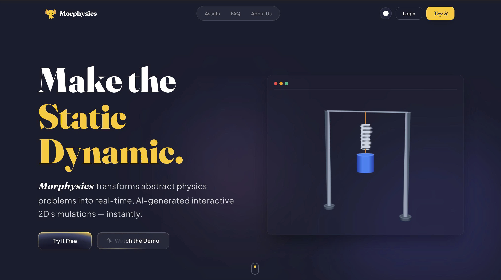
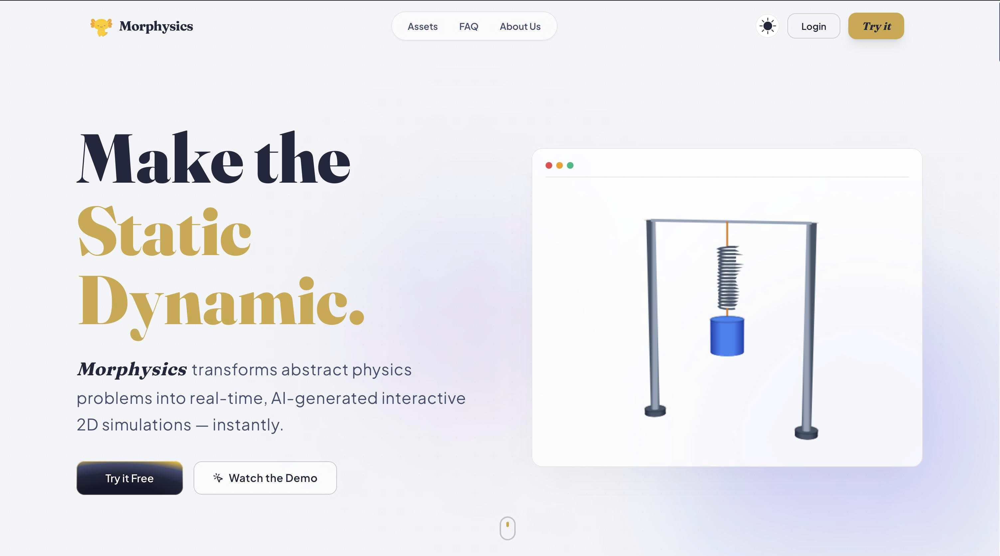
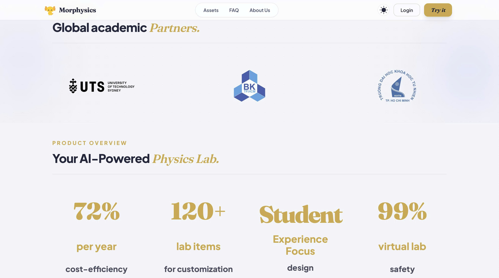
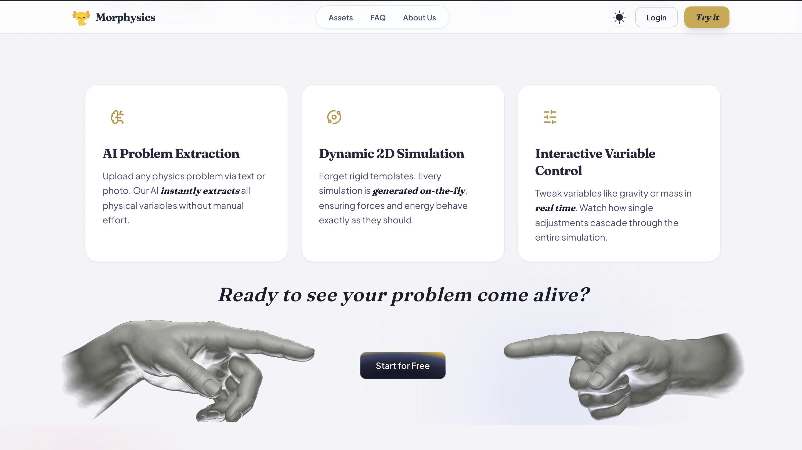

<div align="center">

# Morphysics — Make the Static Dynamic

**Transforming static physics equations into real-time, interactive, AI-driven 2D web simulations.**

[](https://reactjs.org/)
[](https://www.typescriptlang.org/)
[](https://vitejs.dev/)
[](https://tailwindcss.com/)
[](https://brm.io/matter-js/)
[](https://www.framer.com/motion/)

[Key Features](#-key-features) · [Visual Showcase](#-visual-showcase) · [Tech Stack](#-tech-stack) · [Project Structure](#-project-structure) · [Getting Started](#-getting-started)

</div>

---

## 📖 Overview

**Morphysics** is a next-generation educational web platform designed to replace static textbook diagrams with dynamic, interactive visual labs. Built specifically to support students, educators, and institutions in Vietnam by aligning with high school AP/IB physics curricula, Morphysics enables users to experiment with physical forces, motion, electromagnetism, and energy conservation in real time.

Combining a **custom Matter.js 2D simulation engine**, **AI-assisted document-to-simulation generation**, and a **state-of-the-art glassmorphic design system**, Morphysics turns passive formula reading into active, visual discovery.

---

## 📸 Visual Showcase

### 🌟 Landing Page (Light & Dark Modes)
Morphysics features a full-spectrum glassmorphic UI with dynamic theme transitions, ambient particle canvas background, interactive solenoid electromagnetism visualizer, and student review carousels.

<div align="center">
  
  
</div>

<br />

### 🔬 Interactive Physics Lab Dashboard (`#dashboard`)
The core visual lab environment featuring a split-screen layout: an **AI Physics Assistant** with PDF/Document upload support on the left, and an interactive **Matter.js 2D Physics Canvas** on the right, managed by a symmetrical expanding capsule navigation bar.

<div align="center">
  
</div>

<br />

### 📚 Educational Assets Store (`#assets`)
A comprehensive catalog of downloadable textbook worksheets, ready-made simulation setups, formula cheat-sheets, and interactive physics exercise packs.

<div align="center">
  
</div>

<br />

### 🔐 Authentication System (`#login` / `#signup`)
Sleek, responsive authentication interfaces featuring animated input states, validation feedback, and seamless session onboarding.

<div align="center">
  
</div>

<br />

### 💡 Features Breakdown & Pricing Overview
Detailed comparison detailing textbook challenges vs. Morphysics interactive solvers, along with transparent subscription plans.

<div align="center">
  
  
</div>

---

## 🚀 Key Product Features

### 1. 🧪 Interactive Physics Lab (`#dashboard`)
* **Split-Screen Visual Workspace:**
  * **Left Panel — AI Physics Assistant:** Conversational AI assistant supporting quick suggestion triggers ("Simulate Gravity", "Explain Force") and PDF/document uploads to dynamically generate physics scenarios.
  * **Right Panel — Matter.js 2D Simulation Engine:** Interactive canvas allowing creation of circles, boxes, springs, rope constraints, and joint hinges with real-time vector visualizers (velocity, force vectors, grid lines).
* **Symmetrical Dynamic Capsule Navbar:**
  * Floating pill navigation with spring-physics hover expansion (`stiffness: 380, damping: 30`) without layout snapping.
* **Preset Scenario Selector:** One-click instant loading for classic physics experiments: Free Fall, Double Pendulum, Newton’s Cradle, Soft-Body Mesh, and Inclined Plane.

### 2. 🌐 Unified Landing & Marketing Page
* **Hero & Interactive Solenoid Coil:** High-fidelity interactive electromagnetic field visualizer directly inside the hero section.
* **Curriculum Alignment:** Aligned with physics syllabus standards (Classical Mechanics, Thermodynamics, Electromagnetism).
* **Swiper.js Testimonials & Partner Showcase:** Touch-enabled student feedback carousels and university partner wall.
* **Transparent Pricing:** Clear tiered subscription models (Basic vs. Premium) with docs-to-sim entitlement listings.

### 3. ⚙️ Advanced Settings & Profile Customization
* **Personalized User Profile:** Sidebar welcome banner (`Welcome, Long Quan`), custom avatars, and subscription status badges (`Premium Plan`).
* **Circular Theme Switcher:** Smooth circular mask expansion theme toggle leveraging browser View Transitions API and CSS clip-paths.
* **Engine Customization:** Fine-tune gravity vectors, time-steps, notification triggers, and cache clearance tools.

---

## 🛠 Tech Stack

| Layer | Technology | Purpose |
|---|---|---|
| **Core Framework** | **React 18** | Declarative component UI hierarchy and reactive state management |
| **Language** | **TypeScript 5** | Strict type safety for physics payloads, hooks, and UI props |
| **Build Engine** | **Vite 5** | Instant HMR, ultra-fast development server, and optimized bundling |
| **Physics Engine** | **Matter.js & HTML5 Canvas** | 2D rigid-body dynamics, constraint satisfaction, and vector visualizer |
| **Styling System** | **Tailwind CSS 3** | Custom design tokens, glassmorphism utilities, and dark/light variables |
| **Animations** | **Framer Motion 11** | Spring-based layout transitions, capsule nav expansions, and scroll reveals |
| **Interactive Widgets** | **Swiper.js & Lottie** | Touch-enabled testimonial carousels and animated mascot visuals |

---

## 📂 Project Structure

```text
Morphysics---Frontend/
├── Images/                      # Product showcase images
│   ├── LandingPage_Lightmode.jpg
│   ├── LandingPage_Darkmode.jpg
│   ├── LandingPage_2.jpg
│   ├── LandingPage_3.jpg
│   ├── Interactive Lab Page.jpg
│   ├── Assets Page.jpg
│   └── Login Page.jpg
├── frontend/
│   ├── public/                  # Static assets, logos, and Lottie mascot animations
│   ├── src/
│   │   ├── components/
│   │   │   ├── layout/          # Symmetrical capsule navbar, spotlight navigation, footer
│   │   │   ├── physics/         # Matter.js canvas, vector visualizers, spring renderers
│   │   │   ├── playground/      # Physics preset scenarios and textbook helpers
│   │   │   └── ui/              # Glass panels, ThemeToggle, Reveal wrappers, buttons
│   │   ├── sections/            # Hero, About, Assets, Dashboard, FAQ, Login, Signup, Pricing
│   │   ├── hooks/               # useTheme (View Transitions API switcher), usePhysics
│   │   ├── data/                # Landing page content, syllabus data, FAQ repository
│   │   ├── lib/                 # Utility functions (cn class merge helper)
│   │   └── styles/              # Custom Tailwind directives and animation rules
│   ├── index.html
│   ├── tailwind.config.js
│   ├── tsconfig.json
│   └── vite.config.ts
└── README.md                    # Repository documentation
```

---

## ⚡ Getting Started

### Prerequisites
Ensure you have **Node.js** (v18.0.0 or higher) and **npm** installed on your system.

### Quick Setup

1. **Clone the repository:**
   ```bash
   git clone https://github.com/your-username/Morphysics---Frontend.git
   cd Morphysics---Frontend/frontend
   ```

2. **Install project dependencies:**
   ```bash
   npm install
   ```

3. **Start the local development server:**
   ```bash
   npm run dev
   ```
   Open your browser and visit `http://localhost:5173`.

4. **Build for production:**
   ```bash
   npm run build
   ```
   The optimized production bundle will be generated in the `frontend/dist/` directory.

5. **Preview the production build locally:**
   ```bash
   npm run preview
   ```

---

## 💡 Engineering & Architectural Highlights

* **🚀 Ref-Driven Physics Engine Loop:** To guarantee 60 FPS performance on lower-spec student devices, all Matter.js rigid-body coordinates and force calculations bypass React component state re-renders using persistent React `useRef` loops.
* **🎨 Circular Reveal View Transitions:** Implements smooth theme switching via `document.startViewTransition()` combined with radial CSS clip-paths expanding directly from the user's cursor click position.
* **💎 Symmetrical Dynamic Capsule Navigation:** Employs Framer Motion layout springs to dynamically expand capsule width on hover without introducing layout shift or snapping bugs.
* **📍 Cursor Spotlight Ambience:** Computes dynamic CSS variables (`--spotlight-x`, `--spotlight-y`) in React hooks to power interactive radial lighting effects across glassmorphic containers.

---


